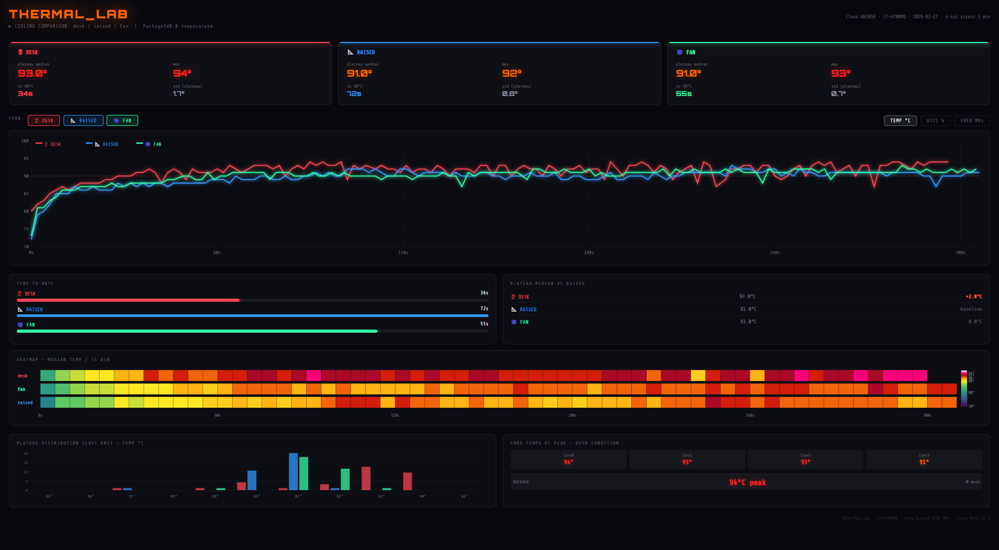

# Phase 1 — Three Baseline Cooling Modes

*← [Back to main README](../README.md)*



---

## Conditions

| Label | Description |
|-------|-------------|
| `desk` | Laptop flat on desk — baseline |
| `raised` | Laptop on a stand, ~15 cm clearance underneath |
| `fan` | Laptop on desk + large household fan blowing across the workspace |

Each test: 5 min, 100% CPU load via `s-tui --csv-file`, ~2s sampling.

---

## Pipeline

```
raw CSV → datetime parse → elapsed seconds → trim 5s warmup
        → rolling median (window=3) → 5s time bins
        → plateau window (last 60s) → metrics + plots → HTML report
```

### How the smoothing method was chosen

Raw telemetry is a noisy 1–2°C sawtooth. The notebook (`notebooks/exploration.ipynb`) worked through approaches in order before the production choice:

| Step | Method | Result |
|------|--------|--------|
| 1 | No smoothing | Unreadable noise |
| 2 | Rolling mean, window 3–5 | Better, but distorted by spikes |
| 3 | Rolling median, window 3–5 | Spike-resistant — **chosen for production** |
| 4 | 10s bin aggregation | Coarser, useful for trend-only views |
| 5 | All four on one plot | Direct comparison — median + binning won |
| 6 | Rolling median, window=50 | "Overview mode", ~100s smoothing, used for early exploration |
| 7 | Min/Max band (fill_between) | Mean line + shaded corridor — shows stability alongside trend |
| 8 | Heatmap, 5s bins | Conditions as rows, time as columns, colour = temperature — the key comparative visual |
| 9 | Delta heatmap (condition − baseline) | Deviation from `raised`; most diagnostic visual of Phase 1 |

**Production choice:** rolling median window=3 for line plots, 5s bin heatmap for condition comparison.

### About the scripts

Three script versions were written during this phase — each a cleaner iteration of the last. Only `HTherMaL_lab_report.py` is needed to reproduce the results:

```bash
python HTherMaL_lab_report.py   # → results/thermal_report.html
```

Earlier iterations are in `src/archive/` for reference.

---

## Results

### Plateau (last 60s)

| Condition | n | Mean | Median | Std | Min | Max |
|-----------|---|------|--------|-----|-----|-----|
| raised | 30 | 90.70 | 91.0 | 0.47 | 90 | 91 |
| fan | 29 | 91.38 | 91.0 | 0.49 | 91 | 92 |
| desk | 30 | 92.77 | 93.0 | 1.13 | 90 | 94 |

`desk` has the highest std (1.13°C) — more spikes, less stable.

### Time to 90°C

| Condition | Seconds |
|-----------|---------|
| raised | 80s |
| fan | 55s |
| desk | 34s |

### Temp ~ Utilisation (Spearman)

| Condition | r |
|-----------|---|
| desk | −0.42 |
| fan | −0.70 |
| raised | −0.44 |

`fan` shows the strongest response to load changes. Not enough to beat `raised` on plateau, but the CPU reacts faster to load drops.

`Temp ~ Freq` weak across all conditions (|r| < 0.12). No frequency throttling observed — CPU held ~3193 MHz throughout.

---

## Key visual: delta heatmap

The delta heatmap was the most diagnostic result of Phase 1. Subtracting `raised` from each condition (5s bins) showed:

- `raised` = flat zero line throughout — the most consistent, smooth thermal profile of all three conditions
- `desk` = +2–4°C above baseline from the first minute, no recovery
- `fan` = occasional dips below raised (small negative patches) but inconsistent; no sustained advantage

This is stronger than a mean comparison: `raised` did not just average lower — it was lower and more stable across the entire test window.

---

## Full report

The complete self-contained report with all plots is at `results/thermal_report.html` — open in any browser. Includes line plots, heatmaps, delta heatmap, time-to-threshold bar chart, and all metric tables.

---

## Phase 1 conclusions

1. `raised` wins on all metrics: lowest plateau, lowest max, slowest to 90°C.
2. Large fan gave no meaningful advantage over simply raising the laptop.
3. Core hypothesis for Phase II: airflow direction > airflow volume.

→ *[Phase II results](../README.md#study-ii--10-conditions-precision-mini-fan)*