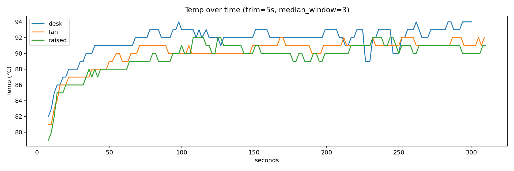
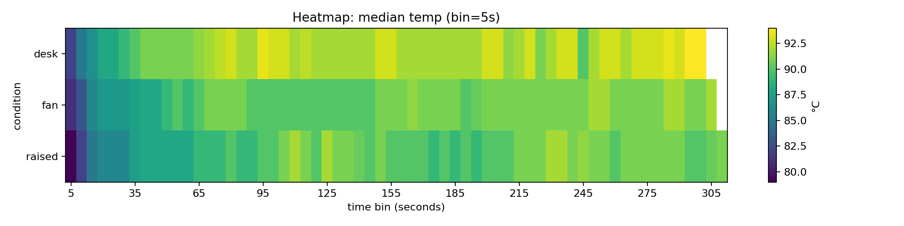
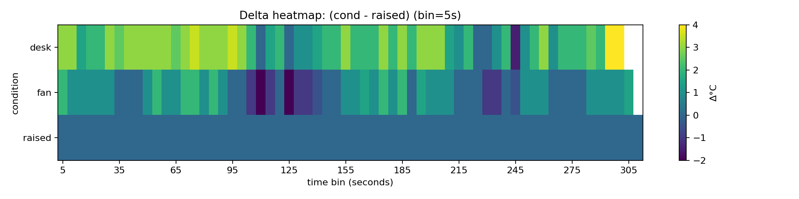
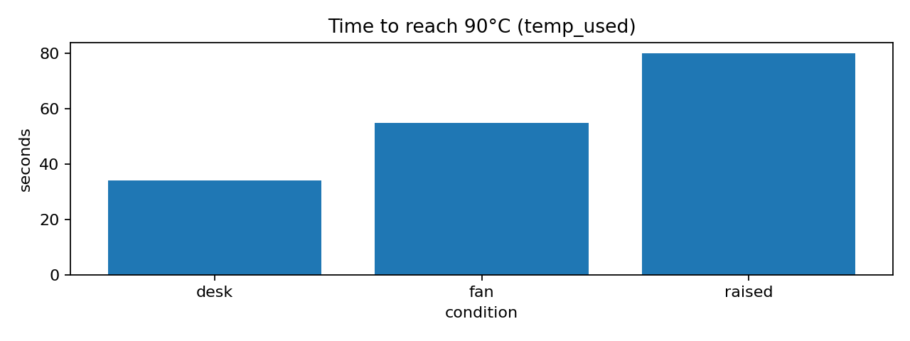

# Thermal Lab Report — cooling experiments

*Generated by [HTherMaL_lab_report.py](../src/HTherMaL_lab_report.py) · Markdown analog of [thermal_report.html](../report/thermal_report.html)*  
*← [Phase 1 overview](../REPORT.md)*

---

## Config

| Parameter | Value |
|-----------|-------|
| EXPERIMENTS | desk · raised · fan |
| TEMP\_COL | Temp:PackageId0,0 |
| BASELINE | raised |
| TRIM\_SECONDS | 5 |
| SMOOTH\_MEDIAN\_WINDOW | 3 |
| BIN\_SECONDS | 5 |
| PLATEAU\_LAST\_S | 60 |
| THRESHOLD\_C | 90 |

---

## Tables

### Summary — plateau stats on temp\_used (last 60s)

| condition | n | mean | median | std | min | max |
|-----------|---|------|--------|-----|-----|-----|
| raised | 30 | 90.700 | 91.000 | 0.466 | 90.000 | 91.000 |
| fan | 29 | 91.379 | 91.000 | 0.494 | 91.000 | 92.000 |
| desk | 30 | 92.767 | 93.000 | 1.135 | 90.000 | 94.000 |

### Time-to-threshold — first temp\_used ≥ 90°C

| condition | time\_to\_90C\_s |
|-----------|----------------|
| desk | 34.000 |
| fan | 55.000 |
| raised | 80.000 |

### Correlations — Pearson vs Spearman

| condition | n | Temp~Freq Pearson | Temp~Freq Spearman | Temp~Util Pearson | Temp~Util Spearman |
|-----------|---|------------------|--------------------|------------------|--------------------|
| desk | 148 | −0.082 | +0.037 | −0.333 | −0.420 |
| fan | 152 | +0.020 | +0.011 | −0.462 | −0.699 |
| raised | 153 | −0.114 | −0.064 | −0.319 | −0.443 |

---

## Plots

### Line: temp over time (smoothed)

### Heatmap: median temp over time

### Delta heatmap vs baseline (raised)

### Time-to-threshold (90°C)

